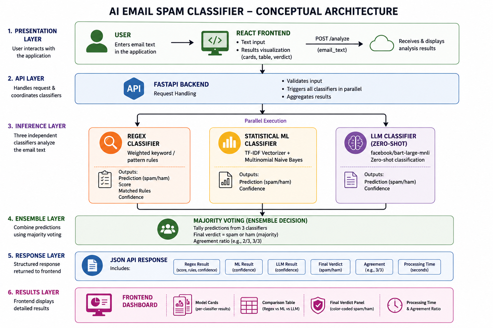
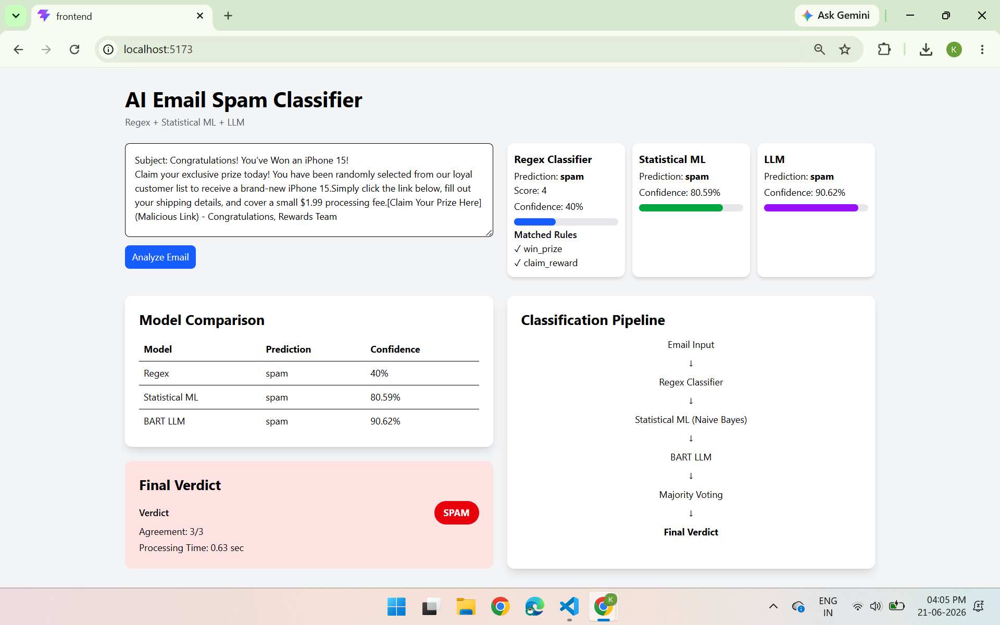

# AI Email Spam Classifier

A full-stack spam detection app that classifies email text using three independent approaches — **Regex rules**, **Statistical ML (Naive Bayes)**, and an **LLM (zero-shot classification)** — then combines their outputs via majority voting into a single verdict.

## Overview

Most spam classifiers rely on a single model. This project compares three fundamentally different techniques side by side on the same input, so you can see where they agree, where they disagree, and how each arrives at its prediction.

| Classifier | Technique | Library |
|---|---|---|
| Regex | Weighted keyword/pattern rules | Python `re` |
| Statistical ML | TF-IDF + Multinomial Naive Bayes | `scikit-learn` |
| LLM | Zero-shot classification | `transformers` (`facebook/bart-large-mnli`) |

The backend runs all three on every request and returns a **majority-vote final verdict**, along with per-classifier confidence scores and processing time.

---
## System Architecture



---

## Tech Stack

**Backend:** FastAPI, scikit-learn, HuggingFace Transformers, joblib, pandas
**Frontend:** React (Vite), Tailwind CSS v4, Axios

## Project Structure

```
Text_Classifier_Project/
├── Backend/
│   ├── app.py                          # FastAPI entrypoint, /analyze endpoint
│   ├── train_model.py                  # Trains & saves TF-IDF + Naive Bayes model
│   ├── classifiers/
│   │   ├── regex_classifier.py         # Weighted regex rule engine
│   │   ├── statistical_ml_classifier.py # TF-IDF + Naive Bayes inference
│   │   └── llm_classifier.py           # Zero-shot BART classifier
│   ├── data/
│   │   └── cleaned_spam.csv            # Training dataset
│   └── saved_models/
│       ├── naive_bayes.pkl
│       └── tfidf.pkl
└── Frontend/
    ├── src/
    │   ├── App.jsx                     # Main UI (input, results, comparison)
    │   ├── main.jsx
    │   └── index.css
    └── vite.config.js
```

---
## Screenshot



---


## How Each Classifier Works

### 1. Regex Classifier
Scans the text for spam-indicative patterns (free offers, urgency phrases, money offers, suspicious links, reward claims), each carrying a weight. Scores ≥ 3 are flagged as spam. Returns the matched rules alongside the prediction.

### 2. Statistical ML Classifier
A `TfidfVectorizer` transforms text into weighted term vectors (English stop words removed), fed into a `MultinomialNB` model trained on the labeled dataset (`train_model.py`). The model and vectorizer are persisted with `joblib` and loaded at inference time.

### 3. LLM Classifier
Uses HuggingFace's zero-shot classification pipeline with `facebook/bart-large-mnli`, prompting the model to classify text against the candidate labels `["spam", "ham"]` without any spam-specific fine-tuning.

### Final Verdict
The backend tallies the three predictions; whichever label (`spam`/`ham`) gets the majority vote becomes the `final_verdict`, reported with an agreement ratio (e.g. `2/3`).

## Setup

### Backend

```bash
cd Backend
pip install fastapi uvicorn scikit-learn transformers torch joblib pandas tqdm

# Train the statistical model (generates saved_models/*.pkl)
python train_model.py

# Run the API
uvicorn app:app --reload
```

API runs at `http://localhost:8000`.

### Frontend

```bash
cd Frontend
npm install
npm run dev
```

App runs at `http://localhost:5173` (default Vite port).

## API Reference

### `POST /analyze`

**Request**
```json
{
  "email_text": "URGENT! Click here to claim your free $500 cash prize now!"
}
```

**Response**
```json
{
  "regex": {
    "prediction": "spam",
    "score": 8,
    "confidence": 80.0,
    "matched_rules": ["free_offer", "money_offer", "claim_reward"]
  },
  "ml": {
    "prediction": "spam",
    "confidence": 94.32
  },
  "llm": {
    "prediction": "spam",
    "confidence": 91.05
  },
  "final_verdict": "spam",
  "agreement": "3/3",
  "processing_time": 0.85
}
```

### `GET /`
Health check — returns `{"message": "Backend running"}`.

## Frontend Features

- Textarea input with a single **Analyze Email** action
- Three side-by-side model cards showing prediction, confidence bar, and (for regex) matched rules
- Model comparison table across all three classifiers
- Color-coded final verdict panel (green = ham, red = spam) with agreement ratio and processing time
- Static pipeline visualization showing the classification flow

## Possible Improvements

- Replace majority voting with a weighted ensemble based on each model's historical accuracy
- Cache the BART model load to avoid reloading on every backend restart
- Add request history / logging for analyzed emails
- Containerize backend + frontend with Docker for easier deployment
- Swap `allow_origins=["*"]` for explicit origins before production use

---

## Developed By
Karthik Aravind M